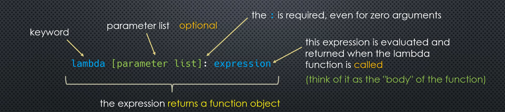

# First-class functions

- can be passed to a function as an argument
- can be returned from a function
- can be assigned to a variable
- can be stored in a data structure (such as list, tuple, dictionary, etc.)

Type such as int, float, string, tuple, list and many others are first-class objects in Python.

Functions (function) are also first-class objects in Python.

## Higher-Order functions

- take a function as an argument
- return a function as the return value

## Topics in this section

1. function annotation and documentation
2. lambda expressions and anonymous functions
3. callables
4. function introspection
5. built-in higher-order functions (such as sorted, map, filter)
6. some functions in the functools module (such as reduce, all, any)
7. partials

## 1. function annotation and documentation

### Docstrings

Is defined at PEP 257.

If the first line of a functions is a string, it will be interpreted as a docstring.

```python
def func(a):
    "documentation for func"
    return a
```

Multi-line are also supported:

```python
def func(a):
    """
    documentation for func
    more details
    """
    return a
```

Where they are stored?

Docstringsd are stored in the `__doc__` attribute of the function.

```python
def func(a):
    """
    documentation for func
    more details
    """
    return a

print(func.__doc__)
```

Is used toa attache metadata to functions.

### Function annotations

Is defined at PEP 3107.

```python
def my_func(a: <expression>, b: <expression>) -> <expression>:
    pass
```

Here is a practical example:

```python
def my_func(a: 'a string', b: 'a positive integer') -> 'a string':
    return a * b

help(my_func)
```

In this case, my_func.__doc__ will be empty. 

This is only metadata, it does not enforce anything.

- Annotations can be any expression:

```python
def my_func(a: str, b: 'int > 0') -> str:
    return a * b
```

- Annotations are stored in the `__annotations__` attribute of the function. And it is a dictionary. Keys are the parameter names. The values ar the annotations.

Where Python use docstrings and annotations? It doesn't use. Mainly used by external tools and modules.

## 2. lambda expressions

lambda is another way to create functions. Also called anonymous functions.



### Examples

```python
lambda x: x ** 2

lambda x, y: x + y

lambda : 'hello'

lambda s: s[::-1].upper()
```

All this objects as function objects, but not "named".

lambdas are not equivalent to closures.

```my_func = lambda x: x ** 2``` is the same as ```def my_func(x): return x ** 2```

### Limitations

- the "body" of a lambda is limited to a single expression
- no assignments
- no annotations
- single line of code

## Lambda and Sorting

See [lambda_sorting.py](lambda_sorting.py)

## Challenge: randomly sort a list

See [challenge_sorted.py](challenge_sorted.py)

## Function introspection

Functions are first-class objects, so they have attributes.

We can attach our own attributes to functions.

```python
def my_func(a, b):
    return a + b

my_func.category = 'math'
my_func.sub_category = 'arithmetic'

print(my_func.category) # math
print(my_func.sub_category) # arithmetic
```

The `dir()` is a bulti-in function that returns the list of attributes of an object.

```python
dir(my_func)
```

### Function attributes

- `__doc__`: docstring
- `__annotations__`: annotations
- `__name__`: name of the function
- `__defaults__`: tuple containing positional parameter defaults
- `__kwdefaults__`: dictionary containing keyword-only parameter defaults
- `__code__`: code object representing the compiled function body, and thi object has many attributes
  - `co_varnames`: tuple containing parameter names and local variables => `my_func.__code__.co_varnames` => `('a', 'b')`
  - `co_argcount`: number of parameters (not including * and ** args) => `my_func.__code__.co_argcount` => `2`

### `inspect` module

```python
import inspect
```

What's the difference between a function and a method?

Classes and objects have attribtes - a n object that is bopund (to the class or the object).

An attribute that is calable, is called a method.

```python
def my_func(): # this function is not bound to anything. It is a function.
    pass

def_MyClass(): 
    def func(self): # this function is bound to an instance of the class. So it is a method and not a function.
        pass

my_object = MyClass()
```

Use inspect to know if an object is a function or a method:

```python
inspect.isfunction(my_func) # True
inspect.ismethod(my_func) # False
inspect.isfunction(func) # False
inspect.ismethod(func) # True

inspect.isfunction(my_object.func) # False
inspect.ismethod(my_object.func) # True

inspect.isroutine(my_func) # True
inspect.isroutine(func) # True
inspect.isroutine(my_object.func) # True
``` 

### Code introspection

We can recover the source code of our functions/methods.

```python
import inspect

inspect.getsource(my_func) # a string containing our entire def statement, including the docstring, annotations, etc.
```

We can find out in which module our function was created.


```python
inspect.getmodule(my_func) # <module '__main__'>

inspect.getmodule(print) # <module 'builtins' (built-in)>

inspect.getmodule(math.sin) # <module 'math' (built-in)>
```

### Function Comments

```python
# setting up a varible
i = 10

# TODO: Implement function
# some additional notes
def my_func(a, b=1):
    # comment inside my_func
    pass

inspect.getcomments(my_func) # '# TODO: Implement function\n# some additional notes\n'
```

### Callable signatures

```python
import inspect

inspect.signature(my_func)
```

Contains an attribute called parameters.

Esentially a dictionary of parameter names (keys) and mertadaa about the parameter (values).

- keys: parameter names
- values: objects with attributes such as name, default, annotatoin, kind.

`kind`:

- POSITIONAL_OR_KEYWORD
- VAR_POSITIONAL (for *args)
- KEYWORD_ONLY 
- VAR_KEYWORD (for **kwargs)
- POSITIONAL_ONLY (we cannot define it in python)

```python
import inspect

def my_func(:a 'a string',
            b: int = 1,
            *args: 'additional positional arguments',
            kw1: 'first keyword-only argument',
            kw2: 'second keyword-only argument' = 10,
            **kwargs: 'additional keyword-only arguments') -> str:
    """does something
       or other"""
    pass

for param in inspect.signature(my_func).parameters.values():
    print('Name:', param.name)
    print('Default:', param.default)
    print('Annotation:', param.annotation)
    print('Kind:', param.kind)
```

## Callables

- Any objects that can be called using the `()` operator.
- callables always return a value
- functions and methods, but it goes beyond

To see if a object is callable, we can use the built-in function: callable => `callable(print)` => True

### Different types of Callables

- built-in functions
- built-tin methods
- user-defined functions
- methods
- classes
- class instances
- generators, coroutines, asynchronous generators

## MAP, FILTER, ZIP

- Higher order functions: a function that takes a function as a parameter and/or returns a function as its return value

### The map function

```python
map(func, *iterables)
```

- *iterables: a variable number of iterable objects
- func: some function that thakes as mnany arguments as ther are iterable objetcs passed to `iterables`

Map returns an iterator that calculates the function applied to each elemnet of the iterables

the iterator stops as soon as one of the iterables has been exhausted so, unequal length iterables can be used.

```python
l = [2, 3, 4]

def sq(x):
    return x**2

list(map(sq, l)) # [4, 9, 16]
```

```python
l = [1, 2, 3]
l2 = [10, 20, 30]

def add(x, y):
    return x + y

list(map(add, l,l2)) # [11, 22, 33]
```

# Filter function

`filter(func, iterable)` 

Will return an iterator that contains all the elments of the iterable for which the function called on it is Truthy.

If the function is None, it simply returns the elements of the iterable that are Truthy.

```python
l = [0, 1, 2, 3, 4]

list(filter(None, l))) # [1, 2, 3, 4]

def is_even(n):
    return n % 2 == 0

list(filter(is_even, l)) # [0, 2, 4]

list(filter(lambda n: n % 2 == 0, l)) # [0, 2, 4]


## zip function

`zip(*iterables)`

[1, 2 , 3]
[10, 20, 30]

zip => (1, 20), (2, 20), (3, 30)

```python
l1 = [1, 2, 3]
l2 = [10, 20, 30]
l3 = 'python'

list(zip(l1, l2, l3)) # [(1, 10, 'p'), (2, 20, 'y'), (3, 30, 't')]

l1 = range(100)
l2 = 'abcd'

list(zip(l1, l2)) # [(0,'a'), (1, 'b'), (2, 'c'), (3, 'd')]

## List comprehension alternative to map

l = [2, 3, 4]

def sq(x):
    return x**2

list(map(sq, l)) # [4, 9, 16]

or

resut = []
for x in l:
    result.append(x**2) # [4, 9, 16]

using list comprehension:

```python
[x**2 for x in l] # [4, 9, 16]

# [<expression> for <varname> in <iterable>]
```

an example using list comprehension + zip()

```python

l1 = [1, 2, 3]
l2 = [10, 20, 30]

list(map(lambda x,y: x + y, l1, l2) # [11, 22, 33]

[x + y for x, y in zip(l1, l2)] # [11, 22, 33]
```

### List comprehension alternative to filter

```python
l= [1, 2, 3, 4]

list(filter(lambda n: n % 2 ==0, l) # [2, 4]

[x for x in l if x % 2 == 0] # [2, 4]
# [<expression1> for <varname> in <iterable> if <expression2>]
```

#### Combining map and filter

```python
l = range(10)
list(lambda y: y < 25, map(lambda x: x**2, l))) # [0, 1, 4, 9, 16]
```

Using list comprehension:

```python
[x**2 for x in range(10) if x**2 < 25] # [0, 1, 4, 9, 16]
```

## Reducing functions

The functools module: python implements a reduce function that will handle any iterable.

```python
from functools import reduce

l = [5, 8, 6, 10, 9]

reduce(lambda a, b: a if a > b else b, l) # max => 10
reduce(lambda a, b: a if a > b else b, l) # max => 5
reduce(lambda a, b: a + b, l) # sum => 38
```

### Built-in reducing functions

- min
- max
- sum
- any => True if any element in l is truthy. False otherwise
- all => True if every element in l is truthy. False otherwise.


## Partial Function

Reducing function arguments

```python
def my_func(a, b, c):
    print(a, b, c)

def fn(b, c):
    return my_func(10, b, c)

fn(20, 30) #10, 20, 30

f = lambda b, c: my_func(10, b, c)

f(20, 30) # 10, 20, 30
```

### Using partial function

```python
from functools import partial

f = partial(my_func, 10)

f(20, 30) # 10, 20, 30
```

- handling more complex arguments

```python
def my_func(a, b, *args, k1, k2, **kwargs):
    print(a, b, args, k1, k2, kwargs)


def f(b, *args, k2, **kwargs):
    return my_func(10, b, *args, k1='a', k2=k2, **kwargs)


f = partial(my_func, 10, k1='a')
```

## The operator module

### Arithmetic Functions

- add(a, b)
- mul(a, b)
- pow(a, b)
- mod(a, b)
- floordiv(a, b)
- neg(a, b)
- and many more...

### Comparison and Boolean Operators

- lt(a, b): less than
- le(a, b):
- is_(a, b)
- gt(a, b)
- ge(a, b)
- is_not(a, b)
- eq(a, b)
- ne(a, b)
- and_(a, b)
- or_(a, b)
- not_(a, b)

### Sequence / Mapping Operator

- concat(s1, s2)
- contains(s, val)
- countOf(s, val)
- getitem(s, i)
- setitem(s, i, val)
- delitem(s, i)

#### Item getters

The intemgetter function returns a callable.

getitem(s, l) takes two parameters, and returns a value: s[i]

```python
s = [1, 2, 3]

getitem(s, 1) # 2
```

itemgetter(i) returns a callable which takes one parameter: a sequence object

```python
f = itemgetter(1)

s = [1, 2, 3]

f(s) # 2

s =  'python'
f(s) # 'y'
```

We can pass more than one index to itemgetter:


```python

l = [1, 2, 3, 4, 5, 6]
s =  'python' 

f = itemgetter(1, 3, 4)

f(l) # (2, 4, 5)

f(s) # ('y', 'h', 'o')
```

#### Attribute getters

The `attrgetter` fucntion is similar to itemgetter, but is used to retrieve object attributes.

It also returns a callable, that takes the object as an argument.

Suppose `my_obj` is an object with three properties:

```python
my_obj.a #10
my_obj.b #20
my_obj.c #30

f = attrgetter('a')

f(my_obj) # 10

f = attrgetter('a', 'b') #(10, 20)
```

- Calling another callable

Consider the str class that provides the upper() method:

s = 'python'

s.upper() # PYTHON

f = attrgetter('upper')

f(s) => returns the upper method of s. It is a callable, and can be called using ()

f(s)() => PYTHON
attrgetter('upper')(s)() => PYTHON

Or, we can use the slightly simpler `methodcaller`function

methodcaller('upper')('python') => PYTHON
